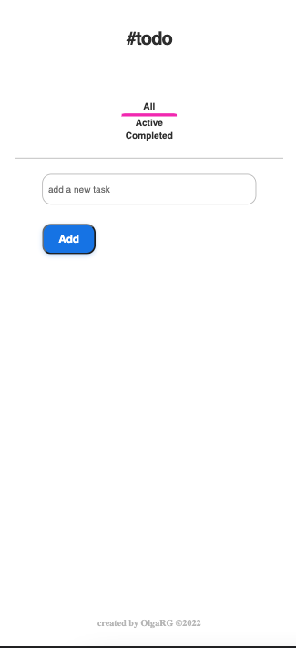
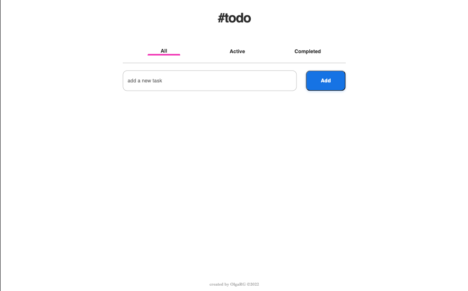
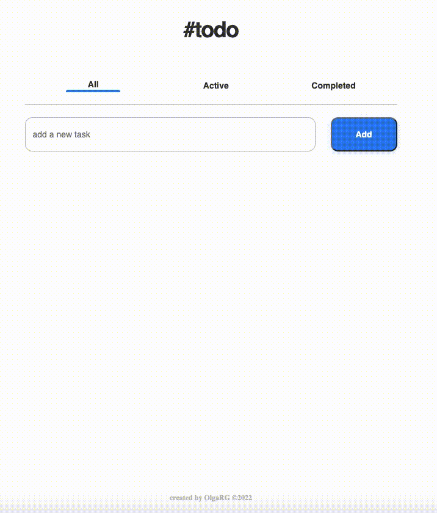

<h1 align="center">{ToDo List}</h1>

   To do list made with React.

  <h3>
    <a href="https://olgargarrucho.github.io/to-do-react/">
      Demo
    </a>
     | 
    <a href="https://github.com/olgargarrucho/to-do-react">
      Solution
    </a>
  </h3>

## Table of Contents

- [Overview](#overview)
  - [Demo](#demo)
  - [Built With](#built-with)
- [Features](#features)
- [Contact](#contact)
- [License](#license)

## Overview

This proyect has been created to practice Reat knowledge.

You can add a new task by clicking the button. At the botton list ahow you all the added tasks.

There are three columns: all tasks, active tasks and completed tasks.

When you completed a task, check it and it will appear in completed tasks column (or all tasks).

Also, the tasks are saved to local storaged. When you reload the page it will reappear.

The page should be responsive:

I have practiced the position of elements with Flexbox and React.

### Demo

If you want to see the final result of this proyect deployed, you can visit [Demo of the proyect](https://olgargarrucho.github.io/to-do-react/)

### Built With

- [HTML5]
- [CSS3]
- [React]
- [Visual-Studio-Node] (https://code.visualstudio.com/download) Version: May 2022
- [Git] (https://git-scm.com/download/mac) Version: 2.36.1
- [Git-Hub] (https://github.com/)

## Features

This site was created to settle the knowledge acquired so far about React.

## Contact

- Website [Linkedin](https://{linkedin.com/in/olgargarrucho/})
- GitHub [@olguita2412](https://{github.com/olgargarrucho})
- Twitter [@olguiita24](https://{twitter.com/olgargarrucho})

## License

Copyright (c) 2022, Olga RG.
